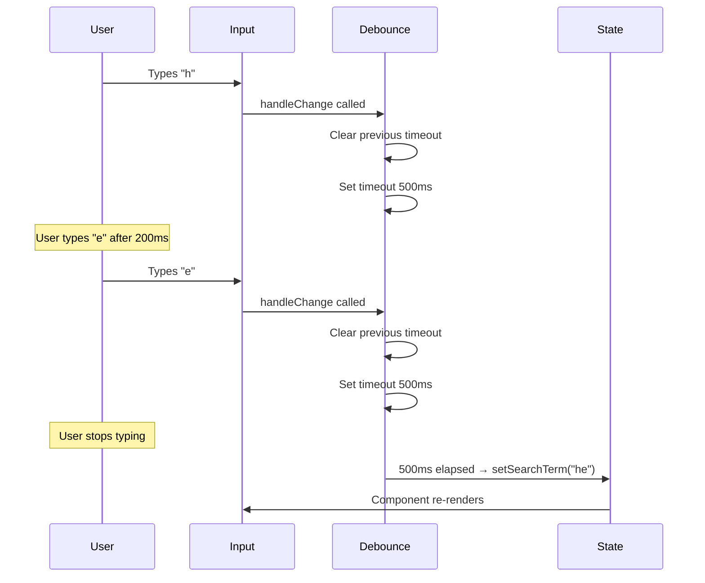

# React Patterns: Compound Components, Render Props & Debounce

A practical demonstration project showcasing three essential React patterns through interactive, real-world examples. This project helps developers understand advanced React concepts with clean, commented code and modern UI design.

## 🎯 Patterns Demonstrated

### 1. Compound Components Pattern
### 2. Render Props Pattern  
### 3. Debounce Implementation

# 📖 Pattern Explanations

## 1. Compound Components Pattern

Compound Components is a pattern where a parent component manages state and exposes child components that implicitly share this state through React Context.

### How It Works in Our Accordion:

```jsx
// Parent component provides context
function Accordion({ children, className }) {
    const [openItemId, setOpenItemId] = useState();
    
    const contextValue = {
        openItemId,
        toggleItem: (id) => setOpenItemId(prevId => prevId === id ? null : id)
    };

    return (
        <AccordionContext.Provider value={contextValue}>
            <ul className={className}>{children}</ul>
        </AccordionContext.Provider>
    );
}
```
```jsx
// Child components consume context
function AccordionTitle({ children, className }) {
    const { toggleItem } = useAccordionContext();
    const id = useAccordionItemContext();
    
    return (
        <h3 className={className} onClick={() => toggleItem(id)}>
            {children}
        </h3>
    );
}
```
### Key Benefits:

- **Implicit State Sharing**: No prop drilling required
- **Flexible API**: Users can rearrange components freely
- **Declarative Structure**: JSX clearly shows component relationships

## 2. Render Props Pattern

Render Props is a technique where a component receives a function as a prop (or children) that returns JSX, allowing the parent to control how data is rendered.

### Implementation in SearchableList:

```jsx
function SearchableList({ items, children, itemKeyFn }) {
    const [searchTerm, setSearchTerm] = useState("");
    const searchResults = items.filter(item => 
        JSON.stringify(item).toLowerCase().includes(searchTerm.toLowerCase())
    );

    return (
        <div className="searchable-list">
            <input type="search" placeholder="Search" onChange={handleChange} />
            <ul>
                {searchResults.map((item) => (
                    <li key={itemKeyFn(item)}>
                        {children(item)}  {/* Render prop called here */}
                    </li>
                ))}
            </ul>
        </div>
    );
}

```
```jsx
// Usage with different render functions
<SearchableList items={PLACES} itemKeyFn={(item) => item.id}>
    {(item) => <Place item={item} />}  {/* Renders Place components */}
</SearchableList>

<SearchableList items={DEBOUNCE_FACTS} itemKeyFn={(item) => item.id}>
    {(item) => item.text}  {/* Renders plain text */}
</SearchableList>
```
### Key Benefits:

- **Separation of Concerns**: Logic and presentation are separated
- **Reusability**: Same component can render different UI structures
- **Flexibility**: Consumers have full control over rendering

## 3. Debounce Implementation

Debounce delays the execution of a function until after a specified wait time has elapsed since the last time it was invoked, preventing excessive function calls.

### Custom Debounce in SearchableList:

```jsx
function SearchableList({ items, children, itemKeyFn }) {
    const lastChange = useRef();
    const [searchTerm, setSearchTerm] = useState("");

    function handleChange(event) {
        // Clear previous timeout
        if (lastChange.current) {
            clearTimeout(lastChange.current);
        }

        // Set new timeout
        lastChange.current = setTimeout(() => {
            lastChange.current = null;
            setSearchTerm(event.target.value);
        }, 500); // 500ms delay
    }

    // Filter logic uses the debounced searchTerm
    const searchResults = items.filter(item => 
        JSON.stringify(item).toLowerCase().includes(searchTerm.toLowerCase())
    );

    return (
        // ... JSX with input calling handleChange
    );
}
```
### 🔄 How Debounce Works:

<div align="center">


</div>
