# React Patterns: Compound Components, Render Props & Debounce

A practical demonstration project showcasing three essential React patterns through interactive, real-world examples. This project helps developers understand advanced React concepts with clean, commented code and modern UI design.

## 🎯 Patterns Demonstrated 

### 1. Compound Components Pattern
### 2. Render Props Pattern  
### 3. Debounce Implementation

---

## 📸 Project Screenshots

<div align="center">

### Compound Components in Action


### Render Props Flexibility


### Modern UI Design


</div>

---

# 📖 Pattern Explanations

## 1. Compound Components Pattern

Compound Components is a pattern where a parent component manages state and exposes child components that implicitly share this state through React Context.

### How It Works in Our Accordion:

```jsx
// Parent component provides context
function Accordion({ children, className }) {
    const [openItemId, setOpenItemId] = useState();
    
    const contextValue = {
        openItemId,
        toggleItem: (id) => setOpenItemId(prevId => prevId === id ? null : id)
    };

    return (
        <AccordionContext.Provider value={contextValue}>
            <ul className={className}>{children}</ul>
        </AccordionContext.Provider>
    );
}
```
```jsx
// Child components consume context
function AccordionTitle({ children, className }) {
    const { toggleItem } = useAccordionContext();
    const id = useAccordionItemContext();
    
    return (
        <h3 className={className} onClick={() => toggleItem(id)}>
            {children}
        </h3>
    );
}
```
### Key Benefits:

- **Implicit State Sharing**: No prop drilling required
- **Flexible API**: Users can rearrange components freely
- **Declarative Structure**: JSX clearly shows component relationships

## 2. Render Props Pattern

Render Props is a technique where a component receives a function as a prop (or children) that returns JSX, allowing the parent to control how data is rendered.

### Implementation in SearchableList:

```jsx
function SearchableList({ items, children, itemKeyFn }) {
    const [searchTerm, setSearchTerm] = useState("");
    const searchResults = items.filter(item => 
        JSON.stringify(item).toLowerCase().includes(searchTerm.toLowerCase())
    );

    return (
        <div className="searchable-list">
            <input type="search" placeholder="Search" onChange={handleChange} />
            <ul>
                {searchResults.map((item) => (
                    <li key={itemKeyFn(item)}>
                        {children(item)}  {/* Render prop called here */}
                    </li>
                ))}
            </ul>
        </div>
    );
}

```
```jsx
// Usage with different render functions
<SearchableList items={PLACES} itemKeyFn={(item) => item.id}>
    {(item) => <Place item={item} />}  {/* Renders Place components */}
</SearchableList>

<SearchableList items={DEBOUNCE_FACTS} itemKeyFn={(item) => item.id}>
    {(item) => item.text}  {/* Renders plain text */}
</SearchableList>
```
### Key Benefits:

- **Separation of Concerns**: Logic and presentation are separated
- **Reusability**: Same component can render different UI structures
- **Flexibility**: Consumers have full control over rendering

## 3. Debounce Implementation

Debounce delays the execution of a function until after a specified wait time has elapsed since the last time it was invoked, preventing excessive function calls.

### Custom Debounce in SearchableList:

```jsx
function SearchableList({ items, children, itemKeyFn }) {
    const lastChange = useRef();
    const [searchTerm, setSearchTerm] = useState("");

    function handleChange(event) {
        // Clear previous timeout
        if (lastChange.current) {
            clearTimeout(lastChange.current);
        }

        // Set new timeout
        lastChange.current = setTimeout(() => {
            lastChange.current = null;
            setSearchTerm(event.target.value);
        }, 500); // 500ms delay
    }

    // Filter logic uses the debounced searchTerm
    const searchResults = items.filter(item => 
        JSON.stringify(item).toLowerCase().includes(searchTerm.toLowerCase())
    );

    return (
        // ... JSX with input calling handleChange
    );
}
```
### 🔄 How Debounce Works:

```mermaid
sequenceDiagram
    participant U as User
    participant I as Input
    participant D as Debounce
    participant S as State

    U->>I: Types "h"
    I->>D: handleChange called
    D->>D: Clear previous timeout
    D->>D: Set timeout 500ms
    
    Note over U: User types "e" after 200ms
    U->>I: Types "e"
    I->>D: handleChange called
    D->>D: Clear previous timeout
    D->>D: Set timeout 500ms
    
    Note over U: User stops typing
    D->>S: 500ms elapsed → setSearchTerm("he")
    S->>I: Component re-renders
```

<div align="center">


</div>

### 🏗️ Project Structure

```text
src/
├── 📁 components/
│   ├── 📁 Accordion/
│   │   ├── 🟦 Accordion.jsx          # Main compound component
│   │   ├── 🟦 AccordionItem.jsx      # Item context provider
│   │   ├── 🟦 AccordionTitle.jsx     # Clickable title
│   │   └── 🟦 AccordionContent.jsx   # Expandable content
│   └── 📁 SearchableList/
│       └── 🟦 SearchableList.jsx     # Render props + debounce
├── 📁 assets/                        # Images and static files
├── 🟦 App.jsx                        # Main application
└── 🎨 index.css                      # Modern glassmorphism styles
```


##  Technical Implementation Details

### 🏛️ Context Architecture
The Accordion uses a dual-context system for optimal state management:

<div align="center">

| Context | Purpose | Data | Components |
|---------|---------|------|------------|
| **AccordionContext** | Global state management | `openItemId`, `toggleItem` | All accordion children |
| **AccordionItemContext** | Item identification | `itemId` | Item-specific children |

</div>

###  Performance Optimizations

<div align="center">


</div>


## Learning Outcomes

Compound Components  
– Building internal component APIs through React Context  
– Sharing state without prop drilling  
– Maintaining controlled composition without extra props

Render Props  
– Applying inversion of control in React rendering  
– Separating data logic from presentation  
– Reusing a single component across multiple UI layouts

Debounce  
– Optimizing performance for input-driven UI  
– Reducing unnecessary re-renders and network calls  
– Applying real-world patterns in search, filtering, and validation flows

## References

– React Docs: Composition vs Inheritance  
  https://reactjs.org/docs/composition-vs-inheritance.html  

– React Patterns  
  https://reactpatterns.com/  

– Compound Components by Kent C. Dodds  
  https://kentcdodds.com/blog/compound-components-with-react-hooks
